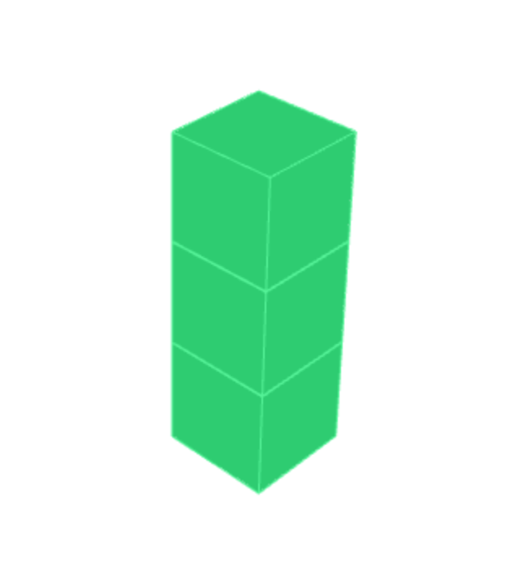
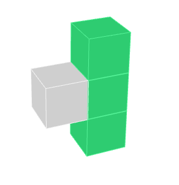

# Example 1
 A simple chain of functions.  Each block is a function.  The output of one block goes into the input of block immediately above it.  If a block has no return value, then the next block will be passed nothing, but will be invoked on the completion of the preceeding block.

<p>
  
</p>

#### build.blocks.js

```javascript
module.exports = [
  {
    id: 0,
    name: 'foo',
    logic: 'lib/foo.js',
    input: []
  },
  {
    id: 1,
    name: 'bar',
    logic: 'lib/bar.js',
    input: [0]
  },
  {
    id: 3,
    name: 'log',
    logic: 'lib/log.js',
    input: [1]
  }
];
```

#### build.js
```javascript
const async = require("async");
const functions = new Map();

functions.set(0, function(callback) {
  const message = 'Foo.'
  callback(null, message);
});

functions.set(1, function(string, callback) {
  string += ' Bar.';
  callback(null, string);
});

functions.set(2, function(string, callback) {
  console.log(string);
  callback();
});

module.exports = function() {
  async.waterfall(functions.get(0), functions.get(1), functions.get(2));
};
```

# Example 2
A more complex function chain.  The output of the second green block is passed to both third green block, and the grey block.

<p>
  
</p>

#### build.blocks.js

```javascript
module.exports = [
  {
    id: 0,
    name: 'foo',
    logic: 'lib/foo.js',
    input: []
  },
  {
    id: 1,
    name: 'bar',
    logic: 'lib/bar.js',
    input: [0]
  },
  {
    id: 2,
    name: 'log',
    logic: 'lib/log.js',
    input: [1]
  },
  {
    id: 3,
    name: 'alert',
    logic: 'lib/alert.js',
    input: [1]
  }
];
```

#### build.js
```javascript
const async = require("async");

const functions = new Map();
const branches = new Map();
const chains = new Map();

functions.set(0, function(callback) {
  const message = 'Foo.'
  callback(null, message);
});

functions.set(1, function(string, callback) {
  string += ' Bar.';
  callback(null, string);
});

functions.set(2, function(string, callback) {
  console.log(string);
  callback();
});

functions.set(3, function(string, callback) {
  alert(string);
  callback();
});

branches.set(1, function(result, callback) {
  chains.get(1)(result);
  chains.get(2)(result);
});

chains.set(1, function(value, callback) {
  function start() {
    callback(null, value);
  }
  async.waterfall([start, functions.get(2)], callback);
});

chains.set(2, function(value, callback) {
  function start() {
    callback(null, value);
  }
  async.waterfall([start, functions.get(3)], callback);
});

module.exports = function() {
  async.waterfall([functions.get(0), functions.get(1), branches.get(1)]);
};
```
